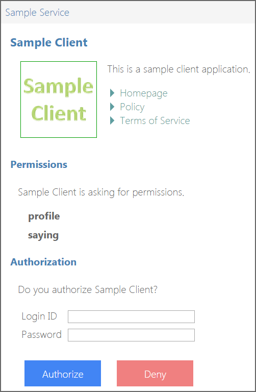
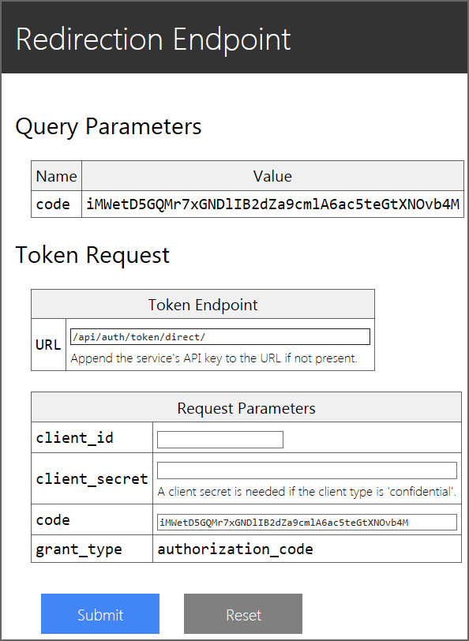
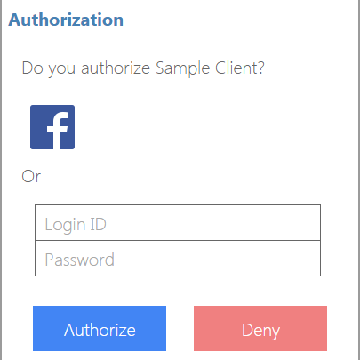
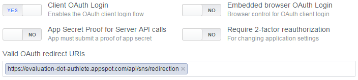
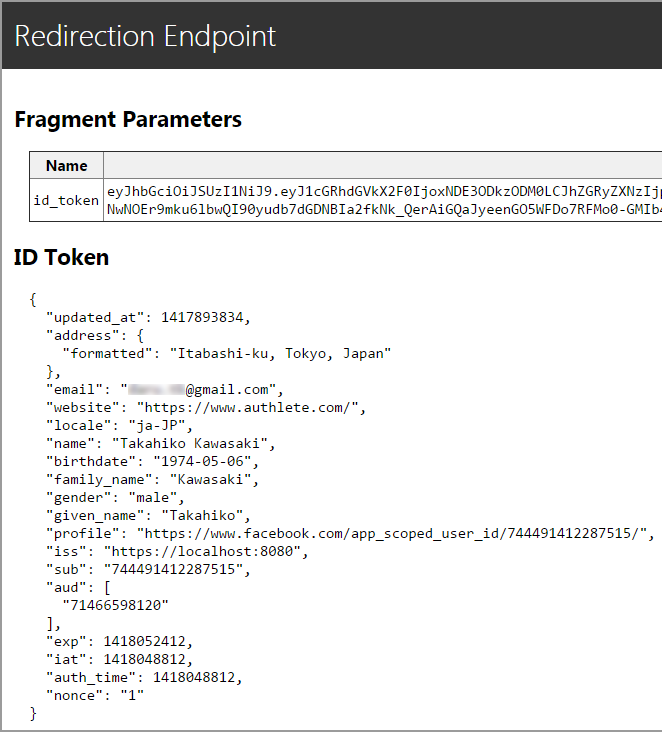

authlete-ruby-quick-start
=========================

# Overview

A sample implementation of OAuth 2.0 server in Ruby using [Authlete]
(https://www.authlete.com/).

This code demonstrates how easy it is to implement OAuth 2.0 server
with **Authlete**. All you have to do is to register the definition of
your service into Authlete and to implement your ***authentication
callback endpoint***. To your surprise, you do not have to implement
the [authorization endpoint](https://tools.ietf.org/html/rfc6749#section-3.1)
and the [token endpoint](https://tools.ietf.org/html/rfc6749#section-3.2)
of your service.

By trying the steps described in this README, you can cover the four
roles that people consciously or unconsciously expect an OAuth 2.0
server to have, that is, **authentication**, **authorization**,
**resource management** and **client management**.


<hr>
# 1. Set Up Service and Client Application

## 1.1 Register Your Account

1. Go to "[Sign Up for Evaluation](https://www.authlete.com/user/registration/evaluation)" page.
2. Register your account, and an email for confirmation will be sent to you.
3. Open the email from Authlete titled "Authlete Registration Confirmation".
4. Click "Complete Registration" button in the email, and your default browser will open the user verification page.
5. Input your login ID (or email address) and password in the page.
6. Click "Download" button to download your API key and API secret.
7. Save the downloaded JSON file (`service-owner.json`) in your local machine.


## 1.2 Download This Source

Execute the following command to download this source.

```sh
$ git clone http://github.com/authlete/authlete-ruby-quick-start.git
$ cd authlete-ruby-quick-start
```


## 1.3 Register Your Service

Execute the following command to register the definition of your service.
${SERVICE_OWNER_API_KEY} and ${SERVICE_OWNER_API_SECRET} in the command
line must be replaced with the values of `apiKey` and `apiSecret` in
`service-owner.json`.

```sh
$ curl -v --user ${SERVICE_OWNER_API_KEY}:${SERVICE_OWNER_API_SECRET} \
       -H "Content-Type:application/json;charset=UTF-8" \
       -d @service-original.json -o service.json \
       https://evaluation-dot-authlete.appspot.com/api/service/create
```

Note: The response from Authlete API may take a long time (a few tens of
seconds) if Authlete server is in sleep mode when you access it.


## 1.4 Register Your Client Application

Execute the following command to register the definition of your client
application. ${SERVICE_API_KEY} and ${SERVICE_API_SECRET} in the command
line must be replaced with the values of `apiKey` and `apiSecret` in
`service.json` (not `service-owner.json`).

```sh
$ curl -v --user ${SERVICE_API_KEY}:${SERVICE_API_SECRET} \
       -H "Content-Type:application/json;charset=UTF-8" \
       -d @client-original.json -o client.json \
       https://evaluation-dot-authlete.appspot.com/api/client/create
```


## 1.5 Make an Authorization Request

Access the following URL with your browser. Of course, don't forget to
replace ${SERVICE_API_KEY} and ${CLIENT_ID} in the URL with your service's
API key and your client's client ID. The value of ${CLIENT_ID} can be found
in `client.json` which was created as the result of the `curl` command above.

```
https://evaluation-dot-authlete.appspot.com/api/auth/authorization/direct/${SERVICE_API_KEY}
?response_type=code&client_id=${CLIENT_ID}
```

This is an [authorization request](https://tools.ietf.org/html/rfc6749#section-4.1.1)
to the [authorization endpoint](https://tools.ietf.org/html/rfc6749#section-3.1)
of your service. On success, you will see an authorization UI like below.




## 1.6 Authorize The Client Application

Input any arbitrary strings to "Login ID" and "Password" fields (any value
other than "nobody" is accepted as a valid login ID). Then, press "Authorize"
button. This will redirect your browser to the redirection endpoint and you
will see a page like below.



Note: The behavior of the authentication here comes from the mock implementation
provided by Authlete. You have to implement your own authentication callback
endpoint to check whether the presented credentials (login ID and password)
are valid or not. This topic is covered later in this README.

Note: The redirection endpoint you see here is the mock implementation provided
by Authlete. A redirection endpoint is supposed to be implemented by a developer
of a client application.


## 1.7 Make a Token Request

The mock implementation of the redirection endpoint contains a form to make
a [token request](https://tools.ietf.org/html/rfc6749#section-4.1.3) to the
[token endpoint](https://tools.ietf.org/html/rfc6749#section-3.2) of your
service. Input "/api/auth/token/direct/${SERVICE_API_KEY}" to "URL" field
(replace ${SERVICE_API_KEY} with your service's API key) and your client's
client ID to "client_id" field. Then, press "Submit" button.

On success, you will get a JSON file like below which contains an access
token and other parameters.

```js
{
  "access_token": "j3JFfgf9p1nuxdQ3Y9fiYisznUzFHmeFagdo7U-do4F",
  "token_type": "Bearer",
  "expires_in": 3600,
  "scope": "profile",
  "refresh_token": "v7L3KFAMEjchrPJe9Sm0vyXeBbzlIfxdc1zxhDOgwvd"
}
```

Note that an authorization code expires in 10 minutes (it is recommended
by RFC 6749), so you have to make a token request without a big delay
after an authorization code was issued.


## 1.8 Summary

If you have reached here without any trouble, it means that your service has
completed [Authorization Code Flow](https://tools.ietf.org/html/rfc6749#section-4.1)
defined in [RFC 6749](https://tools.ietf.org/html/rfc6749) (OAuth 2.0) without
your writing any code. Congratulations!

The next step is to implement your own *authentication callback endpoint* to
authenticate end-users.


<hr>
# 2. Authentication Callback Endpoint

## 2.1 Install Authlete Gem

Execute the following command to install the [authlete gem](https://rubygems.org/gems/authlete).

```sh
$ gem install authlete
```


## 2.2 Start an Authentication Server

Execute the following command to start a sample authentication server which
implements an *authentication callback endpoint*.

```sh
$ rackup --port 9000 authentication-server.ru &
```


## 2.3 Make an Authentication Callback Request

Make an authentication callback request to test the authentication server.

```sh
$ curl -v --user authentication-api-key:authentication-api-secret \
       -H 'Content-Type:application/json;charset=UTF-8' \
       -d @authentication-request.json \
       http://localhost:9000/authentication
```

```js
// The content of authentication-request.json
{
  "id": "user",
  "password": "user",
  "claims": [ "given_name" ]
}
```

On success, you will get a response show below.

```js
{
  "authenticated": true,
  "subject": "user",
  "claims": "{\"given_name\":\"user\"}"
}
```

The authentication callback request that you made just now by the `curl`
command simulates a request from Authlete, and the response in JSON format
shown above is an example of authentication callback responses that your
authentication server is supposed to build.

Details about the requirements for an authentication callback endpoint
are described soon later.


## 2.4 Make an Authentication Server Public

Your implementation of an authentication callback endpoint must be
accessible from Authlete. This means that you have to put your authentication
server on a machine which is publicly accessible via the Internet. However,
it is cumbersome for testing purposes. So, let's use [Localtunnel]
(http://localtunnel.me/) for now. *"Localtunnel will assign you a unique
publicly accessible url that will proxy all requests to your locally running
webserver."*

Install Localtunnel

```sh
$ npm install -g localtunnel
```

and then start Localtunnel for your authentication server which is running
on the port number 9000.

```sh
$ lt --port 9000
your url is: https://monmcbvmqj.localtunnel.me
```

On success, `lt` command reports a URL that has been assigned. In the above
example, `https://monmcbvmqj.localtunnel.me` is the URL.

Make an authentication callback request to the proxy.

```sh
$ curl -v --user authentication-api-key:authentication-api-secret \
       -H 'Content-Type:application/json;charset=UTF-8' \
       -d @authentication-request.json \
       https://monmcbvmqj.localtunnel.me/authentication
```

On success, you will get the same JSON response as illustrated in the
previous section.


## 2.5 Register Your Authentication Callback Endpoint

You need to tell Authlete where your authentication callback endpoint is.
Open `service.json` with a text editor and change the value of
`authenticationCallbackEndpoint`. To be concrete, replace

```js
"authenticationCallbackEndpoint":
  "https://evaluation-dot-authlete.appspot.com/api/mock/authentication",
```

with

```js
"authenticationCallbackEndpoint":
  "https://monmcbvmqj.localtunnel.me/authentication",
```

After saving `service.json`, update the metadata of your service by calling
Authlete's /service/update API.

```sh
$ curl -v --user ${SERVICE_OWNER_API_KEY}:${SERVICE_OWNER_API_SECRET} \
       -H "Content-Type:application/json;charset=UTF-8" \
       -d @service.json \
       https://evaluation-dot-authlete.appspot.com/api/service/update/${SERVICE_API_KEY}
```


## 2.6 Test Connection between Your Authentication Server and Authlete

Make an authorization request again using the same procedure as described in
"1.5 Make an Authorization Request". In the displayed authorization UI, input
different strings to "Login ID" field and "Password" field, and then press
"Authorize" button. If your authentication server responded to an authentication
callback request from Authlete, you will see an error message, "Login ID and/or
password are wrong." This error is caused because the authentication logic of
the sample implementation (= `authentication_user` method in
`authentication-server.rb`) regards given credentials as valid only when the
ID and the password are equal.

After confirming the login failure, input the same strings to "Login ID" field
and "Password" field and press "Authorize" button. This time, you will be
authenticated successfully. Complete the authorization code flow (= make a token
request as described in "1.7 Make a Token Request") and get an access token
and a refresh token. Write down the access token and the refresh token since
they will be used later to test protected resource endpoints.


## 2.7 Social Login

These days, many services delegate end-user authentication to external SNSes
such as Facebook and Twitter. This mechanism is often called **social login**.
In services which support social login, a login form is displayed with SNS icons.

### 2.7.1 Configuration for Social Login

If your service provides end-users with a way to register their user accounts
using their existing SNS accounts, it is natural that you think the login form
displayed at the authorization endpoint should show SNS icons for social login.
You can achieve this by adding two properties to your service's configuration.

The properties are `supportedSnses` and `snsCredentials`. List SNSes in
`supportedSnses` which you want to be displayed in the authorization UI and
list pairs of SNS credentials (= API key and API secret) in `snsCredentials`.

An example below results in that Facebook icon is displayed. Valid values for
`supportedSnses` and `sns` in `snsCredentials` are enum values in
[com.authlete.common.types.Sns]
(http://authlete.github.io/authlete-java-common/com/authlete/common/types/Sns.html).

```js
  "supportedSnses": [
    "FACEBOOK"
  ],
  "snsCredentials": [
    {
      "sns": "FACEBOOK",
      "apiKey": "573550470352118",
      "apiSecret": "eb1b052347931cf9a3752197ba422162"
    }
  ],
```

The resultant UI will look like the following figure.




### 2.7.2 SNS Client Application Representing Your Service

As you can guess, the existence of `snsCredentials` implies that you have to
register a client application (which represents your service) to the target
SNS in advance. One requirement from Authlete for you is to register the
following redirect URI.

```
https://evaluation-dot-api.authlete.com/api/sns/redirection
```

In Facebook, you can find the place to set redirect URIs by following
"Settings" > "Advanced" > "Security" > "Valid OAuth redirect URIs".




### 2.7.3 Social Login Flow

1. When an end-user selects social login at the authorization endpoint of your
   service (`/api/auth/authorization/direct/{service-api-key}`), Authlete
   redirects the user agent to the authorization endpoint of the target SNS.
   For example, in the case of Facebook, the user agent is redirected to
   `https://www.facebook.com/dialog/oauth`. This is the starting point of
   an [authorization code flow](https://tools.ietf.org/html/rfc6749#section-4.1).

2. The client application name that the end-user will see at the authorization
   endpoint of the SNS is not the client application that has accessed your
   authorization endpoint but your service. This is because from a viewpoint
   of the SNS, the client application is your service.

3. At the authorization endpoint of the SNS, the end-user will either authorize
   or deny your service (= a client application from a viewpoint of the SNS).
   In either case, the user agent will be redirected to the registered redirect
   URI (`https://evaluation-dot-authlete.appspot.com/api/sns/redirection`),
   which is Authlete's redirection endpoint.

4. Authlete's redirection endpoint parses the response from the authorization
   endpoint of the SNS. If the response contains `error` parameter, the endpoint
   sends `302 Found` to the user agent in order to redirect it to the redirection
   endpoint of the client application. This is an end of the original authorization
   request initiated by the client application.

5. Otherwise, if the response from the authorization endpoint of the SNS contains
   `code` parameter, Authlete's redirection endpoint takes additional steps listed
   below.

   - Access the token endpoint of the SNS with the authorization code (= the value
     of `code` parmeter) to get issued an access token. For example, in the case
     of Facebook, the token endpoint is `https://graph.facebook.com/oauth/access_token`.

   - Access a Web API of the SNS which provides basic profile information of the
     end-user with the issued access token. In the case of Facebook, the Web API is
     `https://graph.facebook.com/{version}/me`.

   - Call the authentication callback endpoint of your service to ask your service
     to authenticate the end-user. The authentication callback request from Authlete
     contains some SNS-related parameters such as `sns` and `accessToken`. The
     implementation of the authentication callback endpoint is supposed to check
     whether the end-user who is identified by the SNS account is registered or not.

   - Redirect the user agent to the redirection endpoint of the client application.
     This is an end of the original authorization request initiated by the client
     application.


### 2.7.4 Try Social Login

After adding `supportedSnses` and `snsCredentials` to the configuration of your
service and updating it by executing `curl` command (See "2.5. Register Your
Authentication Callback Endpoint" as to how to update the configuration), access
the URL below.

```
https://evaluation-dot-authlete.appspot.com/api/auth/authorization/direct/${SERVICE_API_KEY}
?response_type=id_token
&client_id=${CLIENT_ID}
&scope=openid+profile+email+address
&redirect_uri=https%3A%2F%2Fevaluation-dot-authlete.appspot.com%2Fapi%2Fmock%2Fredirection%2F32785376693
&nonce=1
```

Or, access a working example shown below.

* Authorization Request Example (`response_type=id_token`, `openid` in `scope`)

    https://evaluation-dot-authlete.appspot.com/api/auth/authorization/direct/32785376693?response_type=id_token&client_id=71466598120&scope=openid+profile+email+address&redirect_uri=https%3A%2F%2Fevaluation-dot-authlete.appspot.com%2Fapi%2Fmock%2Fredirection%2F32785376693&nonce=1

You will see the authorization UI with Facebook icon, so click the Facebook icon.

You will be redirected to the authorization endpoint of Facebook and asked whether
you authorize the client application (= your service or Authlete's Sample Service),
so authorize it.

As a result of the authorization, you will be redirected to the redirection endpoint
of the client application. If you have not changed the configration, the redirection
endpoint is `https://evaluation-dot-authlete.appspot.com/api/mock/redirection`, and
you will see the content of an ID token which was generated by Authlete's authorization
endpoint (`https://evaluation-dot-authlete.appspot.com/api/auth/authorization/direct/{service-api-key}`).




## 2.8 Requirements for Authentication Callback Endpoint

### 2.8.1 Input to Authentication Callback Endpoint

* **Basic Authentication**

    If `authenticationCallbackEndpointApiKey` and `authenticationCallbackEndpointApiSecret`
    are registered, Authlete uses them to build the value of `Authorization`
    HTTP header for [Basic Authentication](http://tools.ietf.org/html/rfc2617).
    Implementations of authentication callback endpoint should check whether
    presented API key and API secret via Basic Authentication are equal to
    the registered ones. This is highly recommended.

* **HTTP method**

    `POST` method.

* **Content-Type**

    `application/json`

* **Data Format**

    The entity body of an authentication callback request is JSON. The properties
    contained in the JSON are `serviceApiKey`, `clientId`, `id`, `password`,
    `claims` and `claimsLocales`. [AuthenticationCallbackRequest.java]
    (https://github.com/authlete/authlete-java-common/blob/master/src/main/java/com/authlete/common/dto/AuthenticationCallbackRequest.java)
    in [authlete-java-common](https://github.com/authlete/authlete-java-common)
    represents the latest format. `AuthenticationCallbackRequest.rb` in
    [authlete gem](https://rubygems.org/gems/authlete) represents the format, too.

    `serviceApiKey` is the API key of your service. `clientId` is the ID of
    the client application which has triggered the authentication callback
    request.

    `id` and `password` properties hold the values that the end-user input to
    "Login ID" field and "Password" field in the authorization UI displayed at
    the authorization endpoint. Basically, authentication should be performed
    for these values.

    `claims` is a string array which lists claims names (such as `given_name`)
    requested by an authorization request. 'Claim' is a piece of information
    about an end-user. Some standard claim names are defined in
    "[5.1. Standard Claims](http://openid.net/specs/openid-connect-core-1_0.html#StandardClaims)"
    in [OpenID Connect Core 1.0](http://openid.net/specs/openid-connect-core-1_0.html).
    You can list up claim names as the value of `supportedClaims` which your
    service intends to support. Note that claim names may be followed by a locale
    tag like `given_name#ja`. See "[5.2.  Claims Languages and Scripts]
    (http://openid.net/specs/openid-connect-core-1_0.html#ClaimsLanguagesAndScripts)"
    for details.

    `claimsLocales` is a string array which lists locale names. The values
    come from `claims_locales` request parameter contained in the authorization
    request which has triggered the authentication callback request. See
    "[5.2.  Claims Languages and Scripts]
    (http://openid.net/specs/openid-connect-core-1_0.html#ClaimsLanguagesAndScripts)"
    for details.


### 2.8.2 Output from Authentication Callback Endpoint

* **Content-Type**

    `application/json;charset=UTF-8`

* **Recommended HTTP headers**

    `Cache-Control: no-store`<br>
    `Pragram: no-cache`

* **Data Format**

    The entity body of an authentication callback response must be JSON.
    The properties expected to be contained in the JSON are `authenticated`,
    `subject` and `claims`. [AuthenticationCallbackResponse.java]
    (https://github.com/authlete/authlete-java-common/blob/master/src/main/java/com/authlete/common/dto/AuthenticationCallbackResponse.java)
    in [authlete-java-common](https://github.com/authlete/authlete-java-common)
    represents the latest format. `AuthenticationCallbackResponse.rb` in
    [authlete gem](https://rubygems.org/gems/authlete) represents the format, too.

    `authenticated` is the result of authentication. Set `true` when the
    end-user was authenticated successfully.

    `subject` is the unique identifier of the end-user in your service.
    Note that the value of `subject` is not always equal to the value of
    `id` in the authentication callback request. For example, your service
    may look up an end-user when the given `id` represents an email address
    if your service can identify an end-user from an email address. In such
    a case, the value of `subject` will probably be different from `id`.
    When `authenticated` is `false`, `subject` may remain `null`.

    `claims` is a JSON string which contains pairs of claim name and claim
    value. The following is an example which contains two pairs.

    ```js
    {
      "given_name": "Takahiko",
      "gender": "male"
    }
    ```

    See "[5. Claims](http://openid.net/specs/openid-connect-core-1_0.html#Claims)"
    for details about the format.

    Claims values returned from an authentication callback endpoint are used
    to generate an ID token. If values of requested claims are not available
    at all or if you do not want to provide claim values, `claims` may remain
    `null`.


## 2.8 About Sample Implementations

In this repository, two authentication server implementations are included.
One is `authentication-server.rb` which you have used so far. The other is
`authentication-server-sinatra.rb` which is a very simple implementation
based on [Sinatra](http://www.sinatrarb.com/). If you want to grab the
overall picture of authentication callback endpoint quickly, the source code
based on Sinatra may be better to look into.


<h4>
# 3. Protected Resource Endpoint

The primary reason for people to want to implement OAuth 2.0 is that they
wan to allow third-party client applications to access their services with
limited privileges. In that sense, it can be said that the main goal of
OAuth 2.0 implementation is to provide endpoints (Web APIs) through which
client applications can access resources which are hosted on a service.

A endpoint (Web API) which provides access to a resource in a protected
manner is called a "protected resource endpoint", and a server which
provides protected resource endpoints is called a "resource server".


## 3.1 Start a Resource Server

Execute the following command to start a sample implementation of a
resource server.

```sh
$ export SERVICE_API_KEY=${SERVICE_API_KEY}
$ export SERVICE_API_SECRET=${SERVICE_API_SECRET}
$ ./resource-server-sinatra.rb
```


## 3.2 Access Protected Resource Endpoints

The resource server provides two protected resource endpoints. They are
`/me` and `/saying`. Both accept `GET` requests and return JSON.

`/me` returns just the value of the subject which is associated with the
presented access token. Execute the following command to call `/me`.
Replace ${ACCESS_TOKEN} in the command line with the access token that
you have obtained in "2.6 Test Connection between Your Authentication
Server and Authlete".

```sh
$ curl -v "http://localhost:4567/me?access_token=${ACCESS_TOKEN}"
```

On success, you will get a response like below.

```js
{"subject":"abc"}
```

`/saying` returns a saying randomly. Type the following

```sh
$ curl -v -H "Authorization: Bearer ${ACCESS_TOKEN}" http://localhost:4567/saying
```

and you will get a saying.

```js
{"person":"Albert Einstein","saying":"A person who never made a mistake never tried anything new."}
```

The above examples shows two different means to pass an access token to
a protected resource endpoint. One is `access_token` query parameter and
the other is `Authorization` header. These are standard means defined in
[RFC 6750](http://tools.ietf.org/html/rfc6750) (Bearer Token Usage).


## 3.3 Refreshing an Access Token

If the access token you specified has expired but the refresh token
which was issued along with the access token is still valid, you will
get a response like below.

```js
HTTP/1.1 401 Unauthorized
WWW-Authenticate: Bearer error="invalid_token",
  error_description="[A065301] The access token has expired but it can be refreshed
  using the corresponding refresh token.",
  error_uri="https://www.authlete.com/authlete_web_api_result_codes.html#A065301",
  scope="profile"
```

In this case, you can get a new access token by presenting the refresh
token to the token endpoint.

```sh
$ curl -v https://evaluation-dot-authlete.appspot.com/api/auth/token/direct/${SERVICE_API_KEY} \
       -d grant_type=refresh_token \
       -d refresh_token=${REFRESH_TOKEN} \
       -d client_id=${CLIENT_ID}
```


## 3.4 Access Token Introspection

The first step that a protected resource endpoint has to perform is to check
whether the access token presented by a client application is valid. 'Valid'
here means that the access token satisfies the following conditions.

1. Exists
2. Has not expired
3. Covers required scopes (= permissions) to access the said protected resource
4. Is associated with a proper subject

Authlete provides an API to check whether an access token satisfies these conditions.
It is [/auth/introspection]
(https://www.authlete.com/authlete_web_apis_introspection.html#auth_introspection)
API. The API takes one mandatory request parameter `token` to specify the value of
an access token, and two optional request parameters `scopes` and `subject` to
specify required scopes and subject, respectively.

The example below checks whether an access token exists, has not expired, covers
`profile` and `saying` scopes and is associated with `abc`.

```sh
$ curl -v --user ${SERVICE_API_KEY}:${SERVICE_API_SECRET} \
       https://evaluation-dot-authlete.appspot.com/api/auth/introspection \
       -d token=${ACCESS_TOKEN} \
       -d scopes=profile+saying \
       -d subject=abc
```

When the access token is valid, the API returns a response like below. `"action": "OK"`
indicates that the access token is valid.

```js
{
  "type": "introspectionResponse",
  "resultCode": "A056001",
  "resultMessage": "[A056001] The access token is valid.",
  "action": "OK",
  "clientId": 78247751934,
  "existent": true,
  "refreshable": true,
  "responseContent": "Bearer error=\"invalid_request\"",
  "scopes": ["profile", "saying"],
  "subject": "abc",
  "sufficient": true,
  "usable": true
}
```

On the other hand, for example, if the access token does not cover a required scope,
a response will look like the following. Note that `action` is `FORBIDDEN` and
`sufficient` is `false`.

```js
{
  "type": "introspectionResponse",
  "resultCode": "A064302",
  "resultMessage": "[A064302] The access token does not cover the required scope 'unknown'.",
  "action": "FORBIDDEN",
  "clientId": 78247751934,
  "existent": true,
  "refreshable": true,
  "responseContent": "Bearer error=\"insufficient_scope\",error_description=\"[A064302] The access token does not cover the required scope 'unknown'.\",error_uri=\"https://www.aut
hlete.com/authlete_web_api_result_codes.html#A064302\",scope=\"saying unknown profile\"",
  "scopes": ["profile", "saying"],
  "subject": "abc",
  "sufficient": false,
  "usable": true
}
```

You may have noticed that the value of `responseContent` is lengthy and seems to follow
some kind of technical specifications. As you may have guessed, `responseContent` can be
used as the value of `WWW-Authenticate` HTTP header in the response to the client
application. To be specific, your protected resource endpoint can generate an error
response like below which satisfies the requirements of RFC 6750.

```js
HTTP/1.1 403 Forbidden
WWW-Authenticate: {responseContent}
Cache-Control: no-store
Pragma: no-cache
```

See [/auth/introspection API document]
(https://www.authlete.com/authlete_web_apis_introspection.html#auth_introspection)
for details about what response you should return to a client application.


## 3.5 Access Token Introspection by Authlete Library

There exists Ruby gem ([authlete-ruby-gem](https://github.com/authlete/authlete-ruby-gem/))
for Authlete Web APIs. With the library, access token introspection can be
written as follows.

```ruby
# Create an Authlete client.
client = Authlete::Client.new(
  :host               => Authlete::Host::EVALUATION,
  :service_api_key    => $SERVICE_API_KEY,
  :service_api_secret => $SERVICE_API_SECRET
)

# An access token to introspect.
access_token = 'Fs8YUaWbpBxDdYRXUvN-rQ0Mnq7lxrNq3no5zP-L4R0'

# Optional conditions you require the access token to satisfy.
scopes  = ['profile']
subject = 'abc'

# Introspect the access token and check the validity.
result = client.introspect(access_token, scopes, subject)

# Is the access token valid?
valid = result.action == 'OK'
```

The above code snippet is straightforward. The first mandatory argument of
`introspect` method is an access token to introspect. The second and the
third optional arguments are scopes and a subject. `introspect` method
returns an instance of `Authlete::Response::IntrospectionResponse`.

`Authlete::Client` has another method named `protect_resource` which wraps
`introspect` method. The first argument of `protect_resource` method is an
instance of [Rack Request](http://www.rubydoc.info/gems/rack/Rack/Request)
instead of an access token. The second and the third arguments are the same
as the ones of `introspect` method. `protect_resource` method extracts an
access token from the given request and then calls `introspect` method.
See the source code of `resource-server-sinatra.rb` for example usages of
`protect_resource` method.


# Conclusion

In a narrow sense, an OAuth server is a server for **authorization**.
In a broad sense, people consciously or unconsciously expect the following
four roles when they refer to an OAuth server.

1. **Authentication**
2. **Authorization**
3. **Resource Management**
4. **Client Management**

**Authentication** deals with information about *"who one is"*. Solutions
related to user management belong to this area. You have implemented the
authentication mechanism by implementing **authentication callback
endpoint** in the chapter "2. Authentication Callback Endpoint".

**Authorization** deals with information about *"who grants what permissions
to whom"*. [RFC 6749](http://tools.ietf.org/html/rfc6749) (OAuth 2.0) is
the industry standard for authorization. You have completed this by registering
the definition of your service to Authlete in the section "1.3 Register Your
Service". It should be noted that you did not have to implement the
[authorization endpoint](http://tools.ietf.org/html/rfc6749#section-3.1) and
the [token endpoint](http://tools.ietf.org/html/rfc6749#section-3.2) which
are required by RFC 6749. Authlete provides configurable implementation of
these endpoints that satisfy the requirements of RFC 6749, [OpenID Connect
Core 1.0](http://openid.net/specs/openid-connect-core-1_0.html) and other
related specifications on behalf of you.

**Resource Management** deals with user data. Solutions to host data are
related to this area. In the context of OAuth 2.0, endpoints (Web APIs)
that provide access to resources are called "protected resource endpoints".
[RFC 6750](http://tools.ietf.org/html/rfc6750) lists three ways to present
an access token to a protected resource endpoint. Resource management was
covered in the chapter "3. Protected Resource Endpoint". Authlete provides
[/auth/introspection API]
(https://www.authlete.com/authlete_web_apis_introspection.html#auth_introspection)
to validate an access token and the API helps you to implement protected
resource endpoints of your service.

**Client Management** deals with meta data of third-party client applications.
Client IDs are generated and issued by a service and they are used when
client applications access OAuth 2.0 endpoints. Authlete provides [/client/*
APIs](https://www.authlete.com/authlete_web_apis_client.html) with which you
can manage meta data of client applications. You used [/client/create API]
(https://www.authlete.com/authlete_web_apis_client.html#client_create) in the
section "1.4 Register Your Client Application".

Authlete is a BaaS (Backend-as-a-Service) for authorization. It helps you
to implement OAuth 2.0 and OpenID Connect functionalities quickly. Visit
[our site](https://www.authlete.com/) for details.


<hr>
# License

Apache License, Version 2.0


# See Also

**Authlete, Inc.**
* [Authlete Website](https://www.authlete.com/)
* [Authlete Facebook](https://www.facebook.com/authlete)
* [Authelte Twitter](https://twitter.com/authlete)
* [Authlete GitHub](https://github.com/authlete)
* [Authlete Email](mailto:support@authlete.com)
